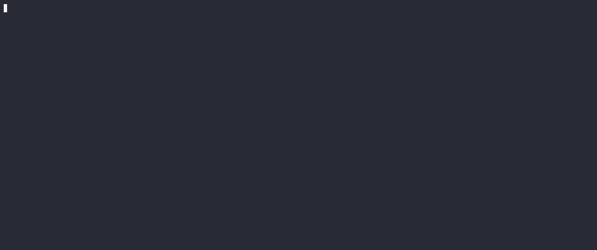
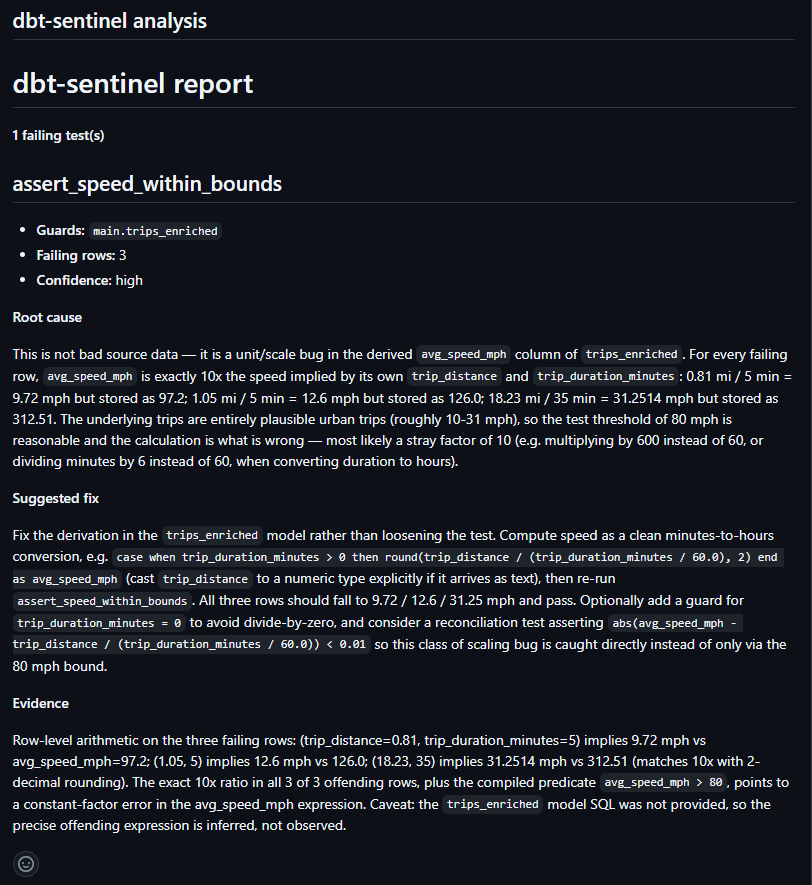

# dbt-sentinel

**dbt tells you a test failed. It doesn't tell you why.** `dbt-sentinel` reads dbt's
run artifacts after a build, pulls the compiled SQL and a sample of the rows that
actually failed, and asks an LLM — grounded strictly in that evidence — for a root-cause
explanation and a concrete fix. It flags low-confidence answers instead of bluffing.

[](https://github.com/qraza/dbt-sentinel/actions/workflows/ci.yml)

[](LICENSE)



Runs in CI too — on every pull request it posts its grounded diagnosis as a comment:



## What this is

A data-quality companion for dbt. When `dbt build` reports a failing test, you normally
get a name and a row count — then you go digging. `dbt-sentinel` closes that gap: it joins
`run_results.json` and `manifest.json` to find each failure, runs the test's own compiled
SQL against the warehouse to sample the offending rows, and sends that concrete evidence to
an LLM with a prompt engineered to stay grounded in it. The output is a structured verdict —
root cause, suggested fix, confidence, and the evidence behind it — in the terminal and,
optionally, markdown for a PR comment. It reads what dbt already produced; it never re-runs
your tests or mutates data (the warehouse is opened read-only).

## Quickstart

```bash
uv sync
export ANTHROPIC_API_KEY="sk-ant-..."
export ANTHROPIC_MODEL="claude-opus-5"

uv run sentinel analyze \
  --target-dir path/to/dbt/target \
  --db path/to/warehouse.duckdb \
  --markdown report.md
```

If all tests pass, it says so and exits. If not, you get a diagnosis per failure.

## How it works
```
dbt build ─► run_results.json (which tests failed, row counts)
manifest.json (compiled SQL, guarded model/column, test type)
│
▼
parse.py join artifacts → FailingTest records
│
▼
context.py run the test's compiled SQL against DuckDB,
│ sample the offending rows (read-only, capped)
▼
analyze.py grounded prompt → LLM → {root_cause, fix,
│ confidence, evidence}
▼
report.py Rich terminal panel + markdown
(via cli.py: sentinel analyze)
```
The design choice that keeps it small and robust: **it reads dbt's artifacts rather than
re-running tests.** Everything it needs — compiled SQL, failing-row count, guarded model —
is already in the JSON dbt writes on every build.

## Grounding is the whole point

An LLM asked "why did my dbt test fail?" with no context invents a plausible-sounding
story. `dbt-sentinel` feeds the model only real evidence — the compiled SQL, the column
schema, and a sample of the actual failing rows — and tells it to ground every claim in
that evidence or report low confidence.

The difference on a real failure (a taxi-trip speed test where `avg_speed_mph` was computed
with a `600` multiplier instead of `60`):

**Naive prompt — test name + row count only, no evidence:**

> Most likely: division by zero or NULL producing infinite/NULL speed. With 1.8M failing
> rows this suggests a systemic data issue. Run these diagnostic queries to pinpoint the
> cause… [three SQL queries checking null/zero durations and negative distances].

**Grounded (dbt-sentinel):**

> The `avg_speed_mph` formula uses a multiplier of 600 instead of 60. A trip of 9.24 miles
> in 52 minutes yields (9.24/52)×60 = 10.66 mph (plausible), but the bug computes
> (9.24/52)×600 = 106.62 — which exactly matches the failing row. The same 10× inflation
> holds across all sampled rows. **Confidence: high.**

The naive answer guesses the wrong cause and hands the work back to you as queries to run.
The grounded answer runs them, finds the real bug, and proves it against a row. See
[`docs/example-analysis.md`](docs/example-analysis.md) for the full output.

## Design decisions

**Read artifacts, don't re-run tests.** dbt writes the artifacts on every build; parsing
them needs no dbt invocation and works against any completed run, including CI.

**Sample rows via the test's compiled SQL.** Some models are ephemeral and aren't queryable
as tables. The test's compiled SQL has that logic inlined, so it returns the offending rows
regardless of materialization.

**Ground, then surface confidence.** The prompt contains only evidence; the model is told to
say "insufficient evidence" rather than speculate, and confidence is shown, not hidden.

**Read-only, always.** The warehouse connection inspects; it never mutates.

## Limitations

- DuckDB warehouse today; the sampling step is where another warehouse would plug in.
- One dbt project per run.
- Models with extended thinking can spend the whole token budget before emitting text,
  so `max_tokens` is set generously; too low a value yields an unparseable (low-confidence)
  result rather than an answer.
- Diagnosis quality depends on the model and on how much signal the sampled rows carry;
  low-signal failures correctly return low confidence.

## Development

```bash
uv sync --group dev
uv run ruff check .
uv run pytest -v
```

CI runs the same lint + tests on every push. Tests use committed fixtures and a mocked API —
no warehouse, no API key needed.

---

Built by [Qamar Raza](https://github.com/qraza).

